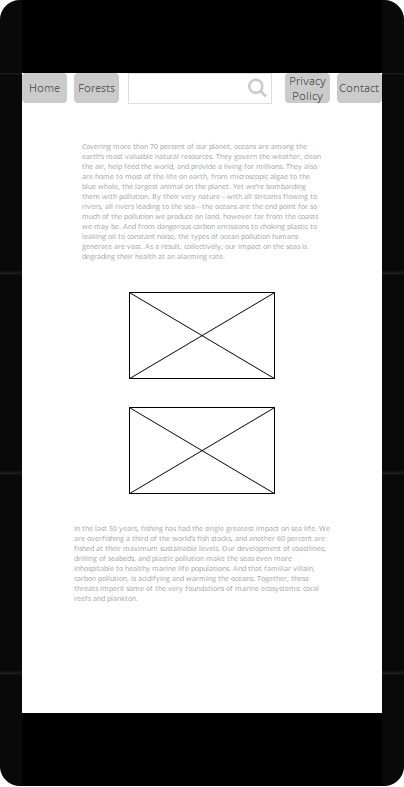

# Ecological Collapse

### Background

One of the main reasons I chose this problem is, because it's really important.
Ecological Collapse could happen any time, whether if the problem is us humans, natural disaster or something outside of our world.
Our world is slowly gettig destroyed, because we are so greedy for certain materials, which will grant us a certain value.
Our forests, oceans and the air we breathe are getting contaminated on daily bases.
The question is: How can we stop this?
I am starting to think that this is not quite possible anymore, but in my opinion the least we can do is:
Stop throwing trash everywhere, recycle, try not to use plastic bags.
Stop the deforestation, this could lead to a lot of problems in the biodiversity,also the trees remove carbon dioxide from the atmosphere and reduce the greenhouse gas effect, all while providing us with clean air to breathe.
Stop polluting the oceans, it is hurting the fish and birds around the ocean since they are mistaking garbage for food or getting caught in it and it's hard for them to escape.

### Wireframe

## Home Page

## Oceans Page

## Forests Page

## Privacy Policy Page

## Contact Page

## Home Page Mobile

## Oceans Page Mobile

## Forests Page Mobile

## Privacy Policy Page Mobile

## Contact Page Mobile

### Colour Choises

The main color in my website is grey, because it's easy on the eyes, and it also represents depression and loss, which fits perfectly with my choise of a problem.

The cerise red on the hyperlinks however represents partying and glamor, which has nothing to do with the topic, but I think that it fits the whole theme, as well as the dodger blue (on hover).

### Accessibility

I've put Alternative text for all of my images and the video.

### GDPR

I created a Privacy Policy page to meet the GDPR requirements.

### Distance Selling

Not applicable

### Evaluation

I had some problems in CSS, some of them were related to the "margin", for example I didn't knew "margin" accepted negative values, so that got me stuck one time, also "positon: absolute;" had me confused a couple of times.
I also had and still have some Javascript problems, for example: I couldn't figure out how to do the "if" statement for my searchbar, aslo I couldn't find the right RegExp Expression for the email validation, but in my opinion that's just lack of knowledge and experience.

I used the "Inspect Element" for the testing on my website.
I had some problems there as well, mostly because of the height of different "div-s" and images.

For the design of my "Home Page" I got inspired by the following webpage:
Global Challenges Fundation (2019), _Ecological Collapse_. Available at: https://globalchallenges.org/global-risks/ecological-collapse/ (Accessed: 10 August 2020).

Most of the information in my website can be found here: Lindwall C. (2019) _U.N. Report: A Million Extinctions and Ecological Collapse Are on the Way_. Available at: https://www.nrdc.org/stories/report-million-extinctions-and-ecological-collapse-are-way (Accessed: 10 August 2020).

I have also pushed my entire work on GitHub.
My repository: https://github.com/EzzoPanayotov/SolentWeb

TED-Ed (2015) _Why is biodiversity so important? -Kim Preshoff_ Available at: https://www.youtube.com/watch?v=GK_vRtHJZu4 (Accessed 10 August 2020).
